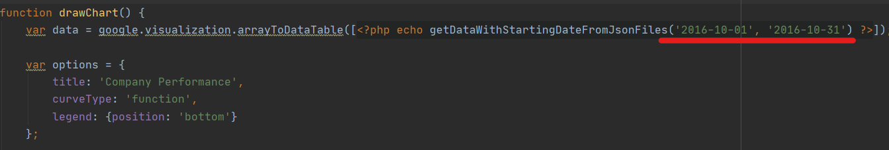
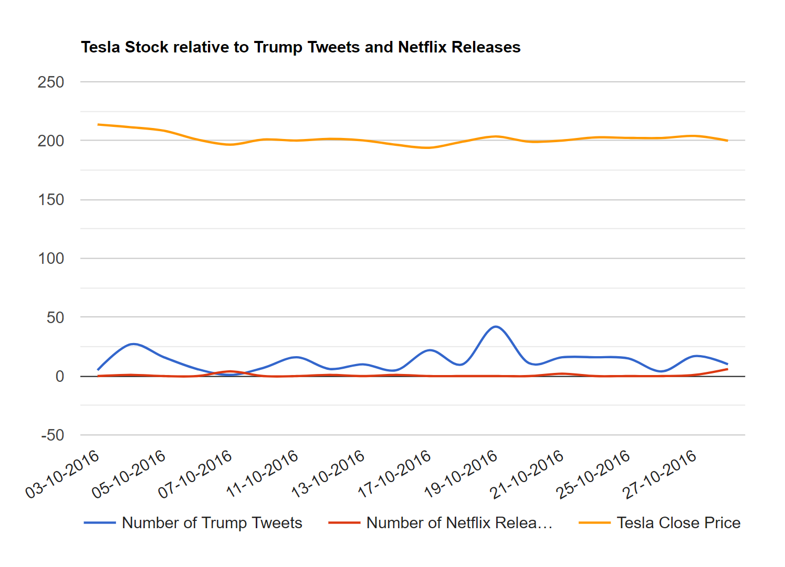

#Steffen API Data Visualizer

This application was created to visualize data acquired from the [Steffen API](https://github.com/AlsoSteffen/steff-data-processing).

 Instructions
---
 1. A localhost is required to run this web application (e.g. xampp).
 2. make sure composer is installed
 3. run `composer install` in the project terminal (`php composer.phar install` if installed local to project)
 4. make sure the api is running locally (or online)
 5. open file in localhost
 
 Notes
---
- The timeline in the main graph can be adjusted in index.php by changing the following parameters:

- Depending on the date range selected loading times may be extreme

---
- If everything is setup correctly the following should be displayed:

